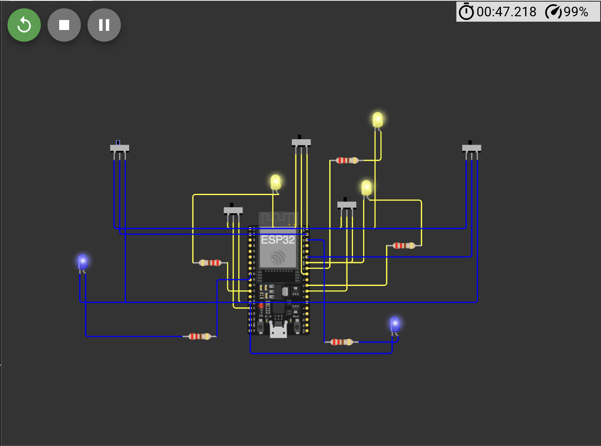

# Hardware/Electrical Schematic

This is a representative circuit for **Work Room 1** (2 fans + 3 lights = 5 devices), built in [Wokwi](https://wokwi.com). Per the problem statement, wiring every one of the 15 devices isn't required — one room is enough to demonstrate the sensing design.

## Why this design

An ESP32's GPIO pins are 3.3V logic. They cannot be wired directly to a 220V fan or light circuit — doing so would destroy the board and is a shock/fire hazard. So the ESP32 never touches mains power in this design. Instead:

- Each device is represented by a **slide switch**, which stands in for a low-voltage sensing signal — in a real deployment, this would be the status output of a relay module switching the actual mains load, or the output of a current sensor (e.g., an ACS712 or SCT-013 clamp) placed on the live wire. Current sensing is the more robust option, since it confirms the device is actually drawing power rather than just trusting that a relay was told to close.
- Each device also has an **LED**, which is the ESP32's visual confirmation that it correctly read the sensed state. It is not a stand-in for the real light/fan itself — it represents the microcontroller's own indicator.
- In a real deployment, the mains-side switching would go through a relay module rated for AC loads, physically isolated from the ESP32's logic side (that isolation is exactly what a relay or opto-isolator provides).

This is a simulation/concept circuit only, per the problem statement — no real hardware is used.

## Why ESP32 over Arduino

The ESP32 has built-in WiFi, which is how the sensed state would actually reach the backend in a real deployment (`HTTP POST` or `MQTT`, noted directly in the sketch). A plain Arduino Uno has no network interface without an add-on shield.

## Components

| Component | Qty | Wokwi search term |
|---|---|---|
| ESP32 DevKit V1 | 1 | `ESP32` |
| Slide Switch | 5 | `Slide Switch` |
| LED | 5 | `LED` |
| Resistor (220Ω) | 5 | `Resistor` |

## Pin map

| # | Device | Switch GPIO (input) | LED GPIO (output) |
|---|---|---|---|
| 1 | Light 1 | GPIO 13 | GPIO 14 |
| 2 | Light 2 | GPIO 16 | GPIO 17 |
| 3 | Light 3 | GPIO 18 | GPIO 19 |
| 4 | Fan 1 | GPIO 21 | GPIO 22 |
| 5 | Fan 2 | GPIO 23 | GPIO 25 |

All ten pins are standard GPIOs with no boot-strapping or flash function, safe to use freely on both the real chip and the simulator.

## Wiring pattern (identical for all 5 devices)

For each device, using its GPIO pair from the table above:

1. Switch **COM** pin → ESP32 **switch GPIO**
2. Switch **pin 1** → ESP32 **3V3**
3. Switch **pin 2** → ESP32 **GND**
4. ESP32 **LED GPIO** → **Resistor** (either leg)
5. Other **Resistor** leg → LED **anode (A)**
6. LED **cathode (C)** → ESP32 **GND**

Wiring the switch to both 3V3 and GND (rather than just one) means the GPIO always reads a clean HIGH or LOW and is never left floating.

## Firmware

[`sketch.ino`](sketch.ino) reads all five switches and mirrors each one onto its paired LED, printing the combined state once per loop. The comment in the sketch marks exactly where a real deployment would replace the `Serial.printf` with a WiFi call to the backend's device-state endpoint.

## Optional bonus: simulating current draw

The problem statement calls out sensing current draw as optional. Wokwi doesn't have a wireable ACS712 part, so the honest stand-in is a **potentiometer** on one device's line, wired to an ESP32 ADC-capable pin (e.g., GPIO 34), labeled in the diagram as "simulates current-sensor output (e.g., ACS712)." This wasn't built into the base circuit to keep wiring time down; add it only if time remains after the core five-device circuit is working.
